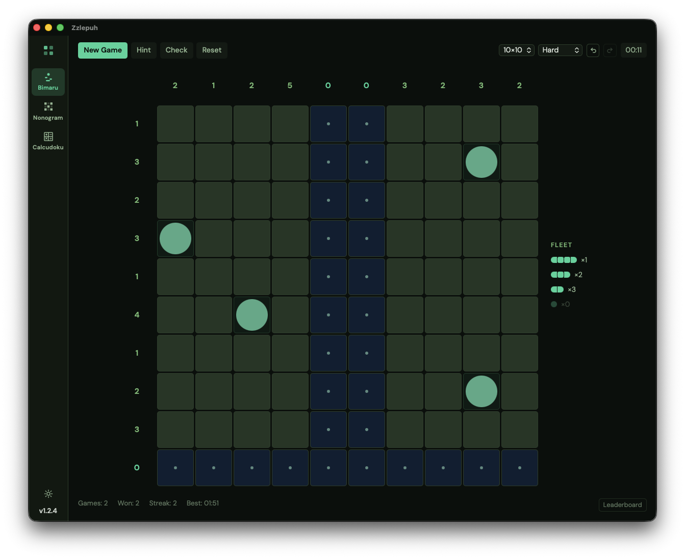
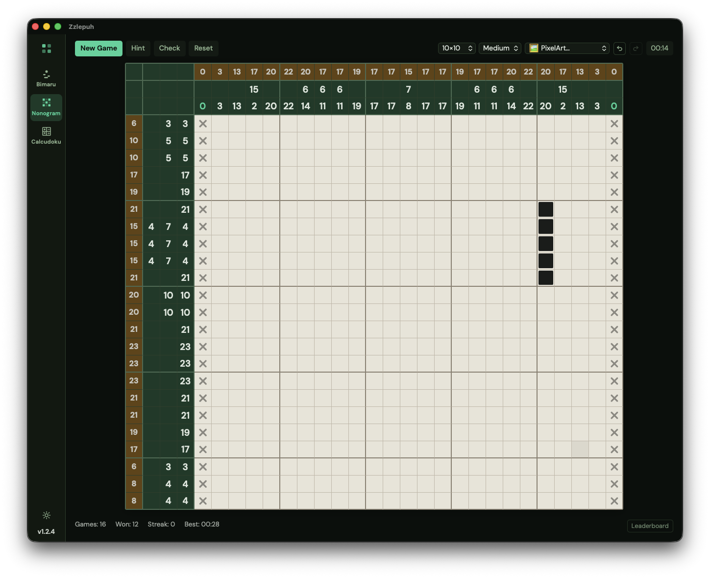
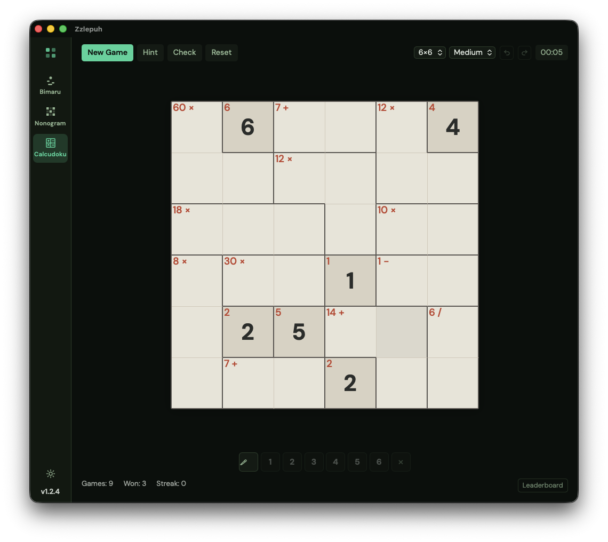

# Zzlepuh

A small desktop app with three logic puzzles: Bimaru, Nonogram, and Calcudoku. There are no ads and nothing to sign into. Open it, pick a puzzle, start solving.

It tracks your stats and keeps a local leaderboard for each game. Dark emerald theme. When a new version is out it updates itself in the background the next time you launch.

## Install

Windows:

1. Grab the latest `zzlepuh_x.y.z_x64-setup.exe` from the [Releases](https://github.com/sreckoskocilic/zzlepuh/releases) page.
2. Run it. It installs for the current user, so there's no admin prompt.
3. Launch Zzlepuh from the Start menu or desktop shortcut.

That's it. The next time you open the app it checks for a newer release and updates in the background, then restarts itself. The version it's running is shown at the bottom of the sidebar.

## The games

### Bimaru (Battleship Solitaire)

Find a hidden fleet on a 10×10 grid. The numbers along the edges tell you how many ship parts go in each row and column, and a few cells are revealed to get you started. Ships never touch, not even diagonally. Left-click places a ship part, right-click marks water. The app figures out the shape of each ship from its neighbours, so you just mark where the ships are and it draws the rest.

### Nonogram (Paint by Numbers)

The clues on each row and column are run lengths of filled cells, for example "3 1 2" means a block of three, then one, then two, with at least one gap between them. Fill the right cells and a picture appears. Left-click fills a cell, right-click marks one you know is empty. Sizes go from a quick 5×5 up to a chunky 25×25.

There's also a **PixelArt** mode in the picker. Those are hand-made picture puzzles, listed only by number so the image stays a surprise until you finish. Solve one and it shows you what you drew.

### Calcudoku (KenKen-style)

Fill the grid so every row and column has each number exactly once, like Sudoku. The grid is split into cages with a small label like "12+" or "6×", and the cells in a cage have to combine with that operation to hit the target. Grids run from 4×4 up to 9×9. There's a notes mode for pencil marks and full undo/redo while you work.

## Hints and checking

Every game has a **Hint** button that fills in one cell you could have worked out, and a **Check** button that flags any mistakes so far. Use them when you're stuck; skip them if you want a clean solve.

## Screenshots

